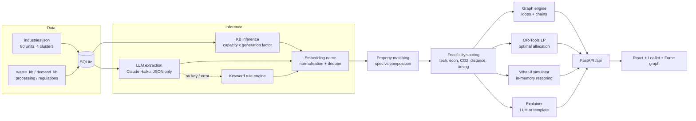

# Sylithex - Discovering Hidden Industrial Symbiosis

> **Marketplaces work when you know what you have. Sylithex finds what you don't.**

[](https://github.com/sagarptdr05/Enigma_Sylithe/actions/workflows/ci.yml)

## Team Name : Sylithe

## Team Members
| Name | Role | GitHub |
|---|---|---|
| Yash | Team Lead · Backend, AI & Optimisation | [@yashpatil12345678](https://github.com/yashpatil12345678) |
| Naivanya | Frontend & UI/UX | _add handle_ |
| Sahil | Data, Knowledge Base & Domain Research | _add handle_ |
| Yash | Matching Engine, Testing & Demo | _add handle_ |

## Problem Statement
Industries generate large volumes of by-products (slag, fly ash, bagasse, spent wash, waste heat, CO2...) that are treated as waste and paid to be disposed of. At the same time, other industries a few kilometres away buy virgin raw materials that these by-products could replace. The opportunities stay hidden because they depend on many coupled factors: **material properties, quantity, location, timing (seasonality), transport, processing and environmental/regulatory impact**. Most units never even declare all their by-products, so marketplace-style listings miss the biggest opportunities.

**Objective:** build a platform that (1) discovers by-products industries have not declared, (2) matches them to other industries' raw-material needs on composition and specification rather than names, (3) scores each exchange for technical, economic, environmental, distance and timing feasibility with regulatory checks, and (4) reveals cluster-level symbiosis networks (multi-hop chains and closed loops) that can serve as eco-industrial park blueprints, with a what-if simulator for changing market conditions.

## Our Solution
1. **Hidden waste inference**: predicts by-products from industry type + capacity (knowledge base) and from free-text process descriptions (Claude LLM, with an offline keyword rule engine as fallback).
2. **Property-based matching**: compares waste composition (CaO, SiO2, Fe2O3, moisture, calorific value, acid %, K2O, temperature...) against each buyer's required spec. Sentence-embeddings (all-MiniLM-L6-v2) normalise free-text names ("GBFS", "vinasse", "lime mud") onto the knowledge base.
3. **Feasibility scoring**: technical fit, economics, CO2 saved, road distance and seasonal timing, plus Hazardous Waste Rules 2016-style permission flags.
4. **Symbiosis graph**: NetworkX finds multi-hop chains (A → processor → B) and closed loops (A → B → C → A) per cluster.
5. **Optimiser**: OR-Tools GLOP linear program allocates each supply to buyers to maximise savings + carbon value without double counting.
6. **What-if simulator**: recomputes all matches in memory when diesel price, carbon price, max distance or virgin prices change, and shows which links drop out.
7. **Company accounts & deal flow**: a plant registers (account + plant details), gets a private **My Plant** dashboard (by-products to sell, inputs to buy cheaper, deal requests), sends **offers / supply requests** to matched plants, and the other plant accepts or declines. Contact details are shared only after acceptance.
8. **Works across contexts**: heavy industry (Taloja, Tarapur), agro-industry (Kolhapur) and urban (Pune-Chakan).

## How It Works


**Matching.** A waste is compatible with a demand if its (embedding-normalised) name is in the demand's `accepted_substitutes`. Technical fit is the mean over required properties of `1` if in range, else `exp(-3 × relative_deviation)`. Pairs with fit < 0.4 are discarded.

**Scoring** (per tonne, or per MWh for energy):
```
transport  = distance_km × 4.5 ₹/t-km × diesel_multiplier        (distance = haversine × 1.3)
saving/t   = virgin_price × virgin_mult − transport − processing + disposal_cost_avoided
economic   = clamp(saving/t ÷ virgin_price, 0, 1)
co2/t      = virgin_co2 − distance × 0.0001      → co2_score = co2/t ÷ max(co2/t)
distance   = 1 − distance / max_distance
timing     = Σ min(supply_m, demand_m) / Σ demand_m    over 12 months

score = 100 × (0.30·tech + 0.25·econ + 0.20·co2 + 0.15·distance + 0.10·timing)
        × 0.9 if hazardous (plus regulatory flags)

tradable          = min(supply, demand)            (per month)
net_saving / yr   = (saving/t + carbon_price × co2/t) × tradable × 12
co2_saved / yr    = co2/t × tradable × 12
```
A match is **viable** when distance ≤ max distance and `saving/t + carbon_price × co2/t > 0`.

**Graph.** Edge A → B if the best A → B match scores ≥ 50. Loops are `simple_cycles` of length 2-5 (industry types not repeated), ranked by total yearly value; chains are A → P → B paths where P emits a different material and A → B is not a direct edge.

## Tech Stack
- **Backend:** Python 3.11+, FastAPI, Uvicorn, SQLAlchemy 2 + SQLite, Pydantic v2, NetworkX, Google OR-Tools (GLOP), NumPy, python-dotenv, pytest
- **Frontend:** React 18, Vite, TypeScript, Tailwind CSS, React Router, TanStack Query, axios, React-Leaflet (OpenStreetMap tiles), react-force-graph-2d, Recharts, Framer Motion, lucide-react
- **AI/ML:** Anthropic Claude (`claude-haiku-4-5-20251001`) for by-product extraction and explanations; sentence-transformers `all-MiniLM-L6-v2` for name normalisation (falls back to difflib); OpenAI CLIP `clip-ViT-B-32` (via sentence-transformers, optional, `USE_CLIP=1`) plus a Pillow colour/texture descriptor for photo matching; pypdf + regex for lab-report extraction (optional Claude vision for scanned reports). **Everything runs without an API key** using deterministic fallbacks.
- **DevOps:** GitHub Actions CI (pytest + frontend type-check/build)

## Setup Instructions
**Prerequisites:** Python 3.11+, Node 18+, Git

```bash
git clone https://github.com/sagarptdr05/Enigma_Sylithe.git
cd Enigma_Sylithe
```

**Backend**
```bash
cd backend
python3.11 -m venv .venv
source .venv/bin/activate          # Windows: .venv\Scripts\activate
pip install -r requirements-dev.txt   # runtime + optional ML models + tests
cp .env.example .env               # ANTHROPIC_API_KEY is optional
uvicorn app.main:app --reload
```
API docs: http://localhost:8000/docs. **Email alerts:** set `SMTP_HOST`, `SMTP_USER`, `SMTP_PASSWORD` and `SMTP_FROM` in `.env` (e.g. Gmail with an app password) to send real emails; without them, each email is saved as an `.eml` file in `backend/outbox/`. The first start seeds SQLite, runs inference for all 80 industries and computes every match (a few seconds). Delete `backend/sylithex.db` to rebuild from scratch.

**Frontend** (new terminal)
```bash
cd frontend
npm install
npm run dev
```
App: http://localhost:5173. Set `VITE_API_URL` if the API is not on `http://localhost:8000`.

**One command (macOS/Linux):** `./run.sh` sets everything up on the first run and starts both servers (`./run.sh --reset` rebuilds the DB).

**Tests:** `cd backend && pytest -q` (58 tests). **Migrations:** automatic on startup (`backend/app/migrations.py`); existing databases are upgraded in place, never dropped.

## Deploy on Vercel
The repo deploys as one Vercel project with two services (`vercel.json`): `frontend` (Vite, public at `/`) and `backend` (FastAPI, public at `/api`). The browser calls the API on the same domain, so no CORS setup or `VITE_API_URL` is needed.

1. Import the GitHub repo in Vercel (root directory = repo root). Vercel reads `vercel.json` and builds both services.
2. Optional environment variables: `ANTHROPIC_API_KEY` (AI inference and summaries), `SMTP_*` (real email alerts), `DEMO_LOGIN=0` to hide one-click demo logins.
3. Deploy. Test locally with `vercel dev`.

How the backend runs on Vercel:
- Dependencies come from `backend/requirements.txt` only. `sentence-transformers` (in `requirements-ml.txt`) is too large for a function, so name matching uses difflib and photos use the colour/texture descriptor.
- The build step `python -m app.prebuild` seeds the demo database once; each new instance copies it into `/tmp` and starts in under a second.
- Only `/tmp` is writable and it is per instance: new registrations, uploads, logins and exchanges made on the live site last only while that instance is alive and are not shared between instances. For persistent data, point `DATABASE_URL` at a hosted database and store uploads in object storage.

## From Opportunity to Completed Exchange (upgrade)
Sylithex goes beyond *listing → search → match → contact*: **discover → understand → verify → assess → connect → exchange → complete → measure impact**.

| Capability | What it does |
|---|---|
| **Discover Alternatives** (`/discover`) | Describe the use ("cement production"), what you buy ("virgin gypsum") and quantity; get ranked alternatives (phosphogypsum, chemical gypsum) gated on properties, quantity, distance, processing, permits, evidence and economics, each with *why* and *why not* |
| **Trust model** | Every stream is AI INFERRED, USER DECLARED or VERIFIED; every property shows its source (AI inferred / user reported / document / lab verified). Inferred supply is never shown as inventory |
| **Material Passport** (`/material/:id`) | Quantity, composition with provenance, availability, applications, processing, hazards, permits, evidence, assumptions and reuse **pathways** compared side by side |
| **Evidence-gated matching** | PASS / FAIL / FIXABLE / UNKNOWN property table (UNKNOWN never passes), evidence completeness %, and a **blocker engine**: main blocker, owner and next action |
| **Confidential marketplace** | A plant can hide its identity; buyers see "Confidential supplier · region" until **both** parties consent. Masking is server-side |
| **Exchange Workspace** (`/exchange/:id`) | Configurable lifecycle interest → evidence → assessment → sample → trial → negotiation → agreement → dispatch → receipt → acceptance → completed, with owners, validation, timeline and *repeat this exchange* |
| **Sourcing requests** | No supplier? Inferred plants appear as *potential supplier, not yet confirmed* and are asked to confirm availability |
| **Buyer vs supplier economics** | Each side's net, lines labelled ESTIMATE / USER PROVIDED / VERIFIED |
| **Network intelligence** | Edge status INFERRED → POTENTIAL → ASSESSED → AGREED → ACTIVE → COMPLETED, decluttered key links, **opportunity-gap funnel** and bottleneck |
| **Impact traceability** | Potential, committed and verified impact shown separately, never summed |
| **Facilitator role** | MIDC Symbiosis Cell verifies evidence and impact, follows up leads and helps stalled exchanges |
| **True landed cost** | Cost per *usable* tonne after freight, handling, storage, processing, testing and rejected loads, vs the conventional material; sensitivity and break-even distance |
| **Supply assurance & backups** | Coverage and shortfall, availability freshness, 12-month history, delivery reliability ("not established" without history), capacity-safe backup allocation, single-source risk |
| **Qualification & trial planner** | Eligibility separate from score; factor weights; evidence states (expired / revalidation required); checklist generated from real gaps; buyer-only approval |
| **Batch records & responsibilities** | Every delivery is a batch with test results, accepted/rejected tonnes, deviations and corrective actions; responsibilities agreed before signing |
| **Missing-link routes** | Processor routes with yield, capacity, two transport legs and before/after properties, always labelled hypotheses |
| **Photo match** (`/photos`) | Suppliers add photos of their by-product, buyers add a reference photo of what they use. Sylithex compares colour, texture, particle size and moisture look (plus CLIP when available), then **ranks candidates by specification first (65%) and appearance second (35%)**: a look-alike that fails the spec is never ranked as compatible. Anyone can also search with an unlisted photo. Photos are re-encoded (EXIF/GPS stripped) |
| **Processing facility registry** (`/processors`) | Operators register drying, grinding, washing or pelletising units with inputs, yield, gate fee and capacity; routes show whether a facility is an example, *unconfirmed* or *confirmed by operator* |
| **Emission factor registry** | Every CO2 figure uses a stored factor with source, year and review status (diesel, truck fuel intensity, grid electricity, per-step energy); a facilitator can update a factor and all matches are recomputed |
| **Lab-report extraction** | Uploading a PDF/TXT/CSV lab report pre-fills purity, moisture, CaO, SiO2, calorific value, issuer, dates and test method; values stay *Document* until a facilitator verifies them |
| **Platform delivery history** | Reliability is computed from batches received on Sylithex when they exist (labelled *platform*), otherwise from supplier-reported history |
| **Notifications** | A bell with unread count on every page (and in the browser tab title). The other party is alerted about every exchange step, comment and offer; suppliers about sourcing requests; owners when evidence is accepted or rejected; the facilitator about new evidence and help requests. Optional email per user (SMTP, or saved to `backend/outbox/` in the demo) and desktop pop-ups while Sylithex is in a background tab. Alerts never contain company names |
| **Time Machine** | Freight, carbon price, conventional prices, processing cost, supply, demand and minimum quality fit, recalculated with the same engine |

In-app explanation: **How Sylithex works** (`/solutions`). Details: [`UPGRADE_AUDIT.md`](UPGRADE_AUDIT.md) · [`PRODUCT_DIFFERENTIATION.md`](PRODUCT_DIFFERENTIATION.md) · [`UPGRADE_SUMMARY.md`](UPGRADE_SUMMARY.md)

## How a Company Uses Sylithex
| Step | What the plant does | What Sylithex does |
|---|---|---|
| 1. Register | Creates an account with plant type, capacity, location (optional process description) | Infers all by-products, including undeclared ones, and matches them |
| 2. My Plant → *Sell your by-products* | Reviews each by-product and its ranked buyers | Shows ₹/yr, CO2, distance, processing & permissions per buyer |
| 3. My Plant → *Buy cheaper inputs* | Sees which raw materials nearby waste can replace | Ranks waste-based suppliers against the plant's spec |
| 4. Send offer / request | One click, with quantity, price and message | Delivers it to the other plant's *Deal requests* inbox |
| 5. Accept / decline | The receiving plant responds | Reveals both contacts on acceptance, so the deal moves offline |

Public pages (Dashboard, Network, Simulator, Impact) serve **MIDC / park authorities and pollution-control boards** planning at cluster level.

**Demo accounts:** the login page has one-click logins for 7 seeded plants (steel, 2 cement, chemical, confidential phosphate fertilizer, sugar, data centre) and 1 facilitator (MIDC Symbiosis Cell). Their emails and shared password are in `backend/app/data/demo_users.json` (local test data). Set `DEMO_LOGIN=0` in production.

## Demo Flow
Click **Demo Mode** (the tour logs in and switches between demo companies automatically):
1. **Raigad Cement Works** (Taloja) buys virgin gypsum.
2. **Discover alternatives**: cement production + virgin gypsum + 500 t/month.
3. **Phosphogypsum** and chemical gypsum are discovered, with reasons.
4. Seven gates, potential value and evidence completeness for each supplier.
5. **⚠ Purity test required**: purity is UNKNOWN; main blocker owner = supplier, action = upload lab report.
6. **Material passport**: provenance of every value, assumptions, pathways (cement vs soil amendment).
7. The supplier (**Deccan Phosphates**) is **confidential**: only "Confidential supplier · Taloja region" is visible.
8. The buyer **expresses interest**: an exchange opens at INTEREST.
9. The supplier accepts and **consents**, so identities and contacts are revealed.
10. Supplier uploads a purity lab report (91%) and submits evidence.
11. Buyer records assessment + sample pass; offer ₹750/t for 450 t/month → agreement → dispatch → receipt → acceptance.
12. **Network**: statuses, chains (supplier → processor → buyer), loops and opportunity gaps.
13. **Impact**: potential vs committed vs verified.

Other seeded history: Konkan Ispat → Boisar Portland BF slag exchange **completed** (verified 11,850 t), Kolhapur Agro Papers ← Panchganga bagasse **committed** (dispatch stage), a steel-slag offer in negotiation and a CO2 request awaiting a reply.

## Screenshots
| Landing | Dashboard | Industry (hidden waste) |
|---|---|---|
| _screenshot_ | _screenshot_ | _screenshot_ |

| Match breakdown | Network loops | Simulator |
|---|---|---|
| _screenshot_ | _screenshot_ | _screenshot_ |

## Assumptions & Data Note
- **Illustrative data**: 80 fictional companies placed at **real industrial locations** (Taloja MIDC, Tarapur MIDC/Boisar, Kagal-Hatkanangale & Shiroli MIDC, Ichalkaranji, Jaysingpur, Warananagar, Chakan MIDC, Mahalunge, Nighoje, Khed) with plot/gat-number addresses. Real company names are deliberately **not** used, so that no actual firm is attributed invented waste figures.
- Generation factors follow typical Indian industry ratios (e.g. ~95 t fly ash per MW per month, 0.30 t BF slag per t hot metal, 0.28 t bagasse per t cane, ~10 t spent wash per kL ethanol, 4.5 t phosphogypsum per t P2O5). Capacities are SME-to-mid scale (e.g. chemical units 300-4,000 t/month, captive power 40-300 MW).
- Prices are calibrated to Indian market levels (GGBS/granulated slag ₹2,200/t, pozzolana ₹1,200/t, steel scrap ₹31,500/t, sulphuric acid ₹7,500/t, industrial CO2 ₹6,500/t, biomass fuel ₹3,400/t coal-equivalent).
- **By-products that are already sold today** (molasses ₹8,500/t, bagasse ₹1,800/t, metal scrap ₹26,000/t, mill scale ₹3,000/t) carry a negative "disposal cost" = current sale value forgone, so only the extra margin of a direct symbiosis contract counts as a saving.
- CO2 capture cost depends on concentration: dilute flue gas (13-25% CO2) needs amine capture (~₹4,700/t), fermentation / biogas CO2 (>95%) only purification (~₹1,100/t).
- Units: tonnes/month (energy streams in MWh/month), currency INR. Virgin prices and CO2 factors are expressed **per tonne of substitutable input** (e.g. spent wash is priced on a potash-equivalent basis; bagasse vs coal on an energy-equivalent basis).
- Transport: 4.5 ₹/t-km road freight, road distance = haversine × 1.3. Waste heat and biogas are only matched within 20 km (heat/gas networks), and a buyer that generates the same energy stream itself is assumed to use its own first.
- Regulatory flags are "Hazardous and Other Wastes Rules 2016 style" (MPCB authorisation, Rule 9 utilisation, manifest system) and are indicative, not legal advice.
- Declared vs hidden: about 65% of units "declare" their most obvious by-product; everything else must be inferred.
- Impact totals come from the LP allocation, so a tonne of waste is never counted for two buyers.
- **Example records are labelled**: the 7 seeded processing facilities and the seeded material photos are marked *example* in the UI until an operator registers or confirms real ones; default emission factors show their source and a *verify* status until a facilitator reviews them.

## Future Scope
- **CPCB/MPCB data integration**: ingest consent-to-operate, hazardous waste returns (Form 4) and ENVIS data instead of synthetic data.
- **IoT waste meters**: live generation data from weighbridges, flow meters and heat meters to replace KB estimates.
- **Marketplace and contracts**: offtake agreements, logistics booking, quality certificates and escrow.
- **WhatsApp/SMS alerts** on top of the existing in-app, email and desktop notifications.
- **Carbon credit linkage**: convert verified CO2 savings into CCTS / voluntary carbon credits.
- OCR for scanned lab reports without an API key; multi-period optimisation with storage for seasonal streams.

---
*Decisions log:* project/brand name **Sylithex**, team **Sylithe**, repo `Enigma_Sylithe`. Python 3.12 was used locally (3.11+ supported; CI runs 3.11). Page transitions animate position only so content never depends on an animation finishing.
